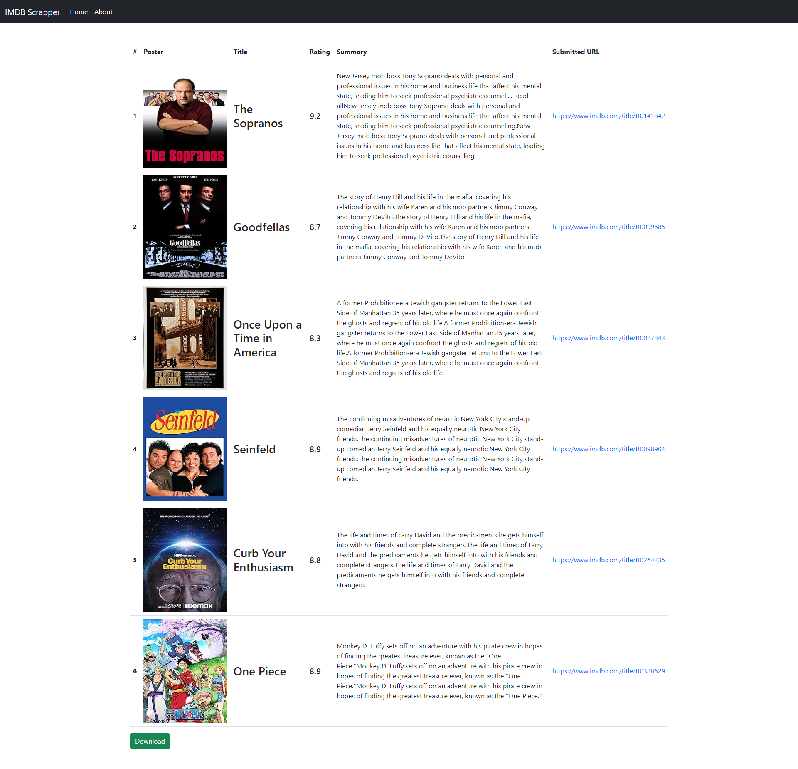

# Web Scraper

This is a web application that uses web scraping technique to extract information from IMDb for a list of TV shows. 
The application accepts a comma-separated list of IMDb URLs and retrieves data such as the show's poster, title, and rating. 
It then presents this information in a clean and organized table format and allows the user to export the scraped data as a .csv file. 
The application is built using Node.js, ExpressJs, EJS, Bootstrap, Axios, and Cheerio.

> **Note:** It is uncertain whether this application will continue to work in the future,
> as IMDb has the capability to change the accepted headers for each request.
> Additionally, they may modify the CSS classes that contain the data I was extracting using Cheerio.
> Also i need to mention that this project is intended for educational purposes only.

## Features

- Accepts IMDb URLs: You can input a list of IMDb URLs for TV shows, separated by commas.
- Information Extraction: The application scrapes the provided URLs to extract relevant data, including the show's poster, title, and rating.
- Table Presentation: The extracted information is presented in a user-friendly table format, making it easy to view and analyze the data.
- Download as CSV: The application allows you to download the extracted data as a CSV file, enabling you to further analyze or manipulate the information using other tools.

## Overview

## Demo
> This gif shows a brief overview of the project, and it may take a while to load!

## Usage
To run this application locally, follow these steps:
- Clone the repository: git clone https://github.com/mohammedamcs/web-scraping.git
- Navigate to the project directory: cd web-scraping
- Install the dependencies and run: npm install && npm start
- Open your web browser and visit: http://localhost:3000
> Make sure you have Node.js and npm (Node Package Manager) installed on your machine before running these commands.
